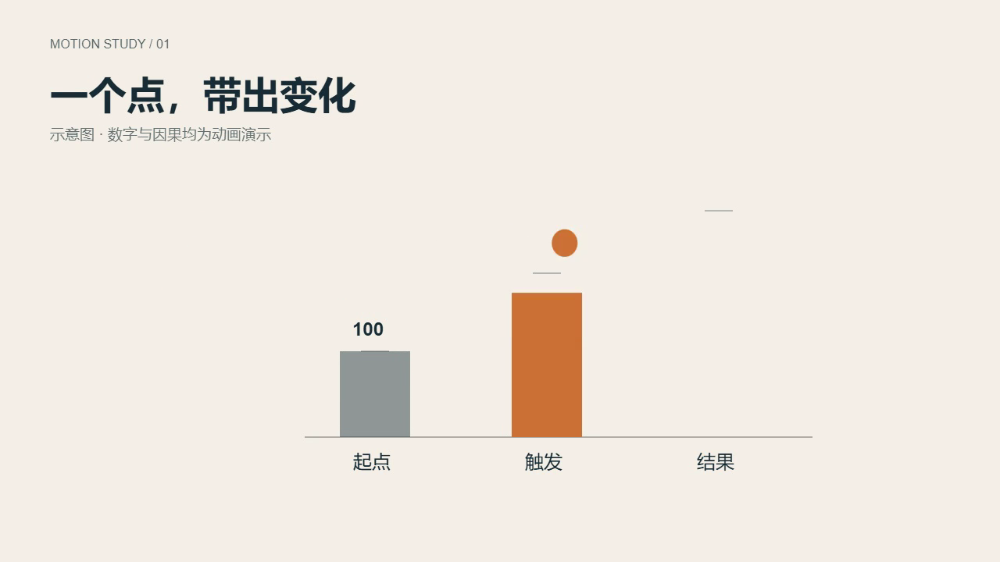
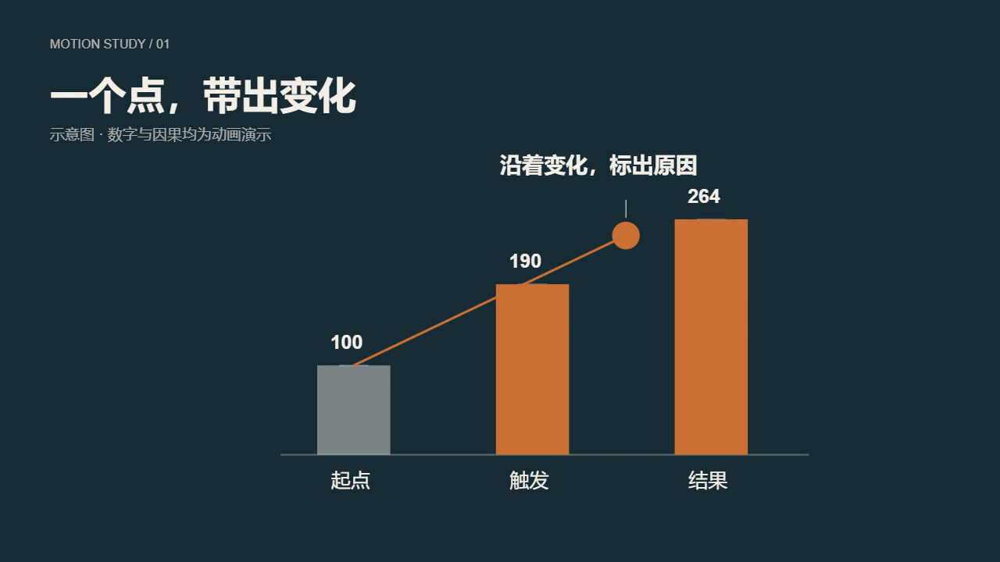

# 一个点，带出变化

原创 10 秒双镜头短预览：圆点先抵达标记，柱体随之生长；同一个圆点跨过镜头边界，变成沿变化路径的原因标记。基期柱始终保留，明暗段落使用一致的字体与强调色。数字和因果是明确标示的动画示意，不是实证数据。

打开 `index.html` 即可离线播放、暂停和拖动；`?t=6.5&controls=0` 定格。两个 `frames/*.html` 共用 `scene.js`，通过现有 `player.js` + `engine-bridge.js` 暴露真实 `window.__tl.pause(t)/time()/duration()`；只提供 `__seek` 无法接入引擎。




## 使用方法

从仓库根目录运行，先用 `python scripts/setup.py` 核对环境，再将 `BROWSER_PATH` 指向实际安装的 Chrome/Edge/Chromium：

```powershell
$env:BROWSER_PATH='C:\Program Files\Google\Chrome\Application\chrome.exe'
node vendor/html-explainer/tests/test_motion.mjs
node tests/causal-motion.cjs
python vendor/html-explainer/scripts/lint_frames.py --project examples/causal-motion
python scripts/engine.py render examples/causal-motion --concurrency 1
ffprobe -v error -count_frames -show_streams -show_format -of json examples/causal-motion/out/causal-motion.mp4
ffmpeg -v error -i examples/causal-motion/out/causal-motion.mp4 -f null -
```

其他系统用其 shell 设置真实浏览器路径。浏览器测试从本机已装软件中探测，仍可用 `BROWSER_PATH` 覆盖；不会下载浏览器。依赖采用仓库锁定的 playwright-core。成片和渲染缓存遵循既有忽略规则；仓库保留真实导出代表帧，视频可由上述命令重建。

复用时选需要的动作：`arcHop` 移动主体、`spring` 响应触发、`landHit` 短暂形变、`camTrack/layerMatrix` 调整视角、`riseWord` 呈现注记。自己确定构图、主题、内容、时间与路径。本例使用 Canvas，亦可把同一数字输出应用到 DOM/SVG。无需固定元素 ID、模板或场景 DSL。

场景局部秒数加 `data-offset`，把两镜头连到同一条逻辑时间线上。改动镜头时长或 fps 时重建 `layout.json` 的 `total_frames` 和每幕边界。改成配音项目时使用用户指定声音与真实配音时间轴，不沿用这个无声示意的固定长度。

## 本次实测

- Windows 原生 Chrome、Node 22.19.0、FFmpeg；148 条上游数值断言通过
- 浏览器 17 个时刻反序重访截图哈希一致，两个 HTML 在 5 秒交界处 Canvas 逐像素相同
- 触发前柱体不生长，基期保留；无页面或资源错误
- 最大估计位移 31.81 px/帧，保守默认导出：legacy、shutter 0、scale 1、并发 1
- H.264，1280×720，24 fps，240 帧，10.000 秒，无音频流；FFmpeg 完整解码通过
- 检查浅色触发、跨镜承接和深色结论代表帧，调整原因注记与结果数字间距

浏览器 QA 默认为系统临时目录 `causal-motion-qa`（可用 `CAUSAL_MOTION_QA` 覆盖）。这些结果验证当前示意的可运行性和确定性，不构成作品质量或模型能力提升的基准结论。

## 来源

HXM 数值动效选择性取自 OneMoh/html-explainer `820a295eb8d285f9023c715fe6cf6d0f31e03e45`（MIT，© 2026 Moh，`../../vendor/html-explainer/LICENSE`）。只调整库头说明以匹配本项目契约，未改变数值 API。`player.js`、`engine-bridge.js`、`ThemeMotion` 与预览样式来自本仓库已有 MIT 共享素材；主题、双镜头绘制、构图与时间编排为本例新写。没有下载外部图像、调用付费服务或更改用户声音设置。
